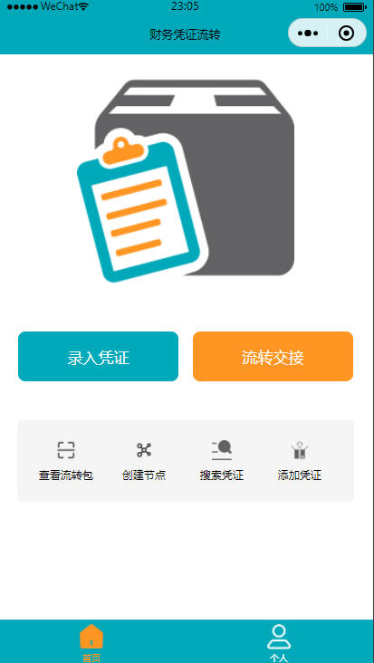

# 部署流程
## MySQL数据库
自行创建数据库后，执行[`db.sql`](db.sql)脚本文件创建表结构，同时插入初始内容。其中`node`表中的“起点”那项数据不宜更改，否则需要修改后端代码

## 后端
* 安装依赖
```bash
pip install -r requirements.txt
```
若因国内网络问题导致安装速度慢，可在命令结尾添加`-i https://pypi.tuna.tsinghua.edu.cn/simple `以使用清华镜像源

本系统开发全程在 Windows 中完成，在 Linux 上运行时相关依赖版本可能有所差异，须自行调整版本号，一般安装最新版即可

* 连接数据库

在[`config.py`](config.py)中以格式`mysql://db_user:passwd@db_IP/db_name`填写数据库信息

* 启动命令
```bash
python -m flask run --host=0.0.0.0 
```

## 前端
须在获取微信小程序开发者的 APP ID ，获取流程参考博客：https://blog.csdn.net/Captinyoo/article/details/136433186

获得 APP ID 后在[`app.js`](front-end/app.js)中根据后端运行的 IP 修改 globalData 下的 serverip

* 效果图

